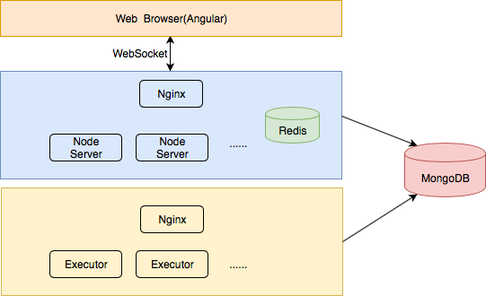

# Collaborative Online Coding System
## Overview
Collaborative Online Coding System is a full-stack system supporting collaborative code editing, compiling and execution.
## Major Use Cases
1. User can use interactive code editor to edit code. Supported languages are Java, C++ and Python.
2. Multiple users can edit the same piece of code simultaneously. Each user’s change can be seen and applied to every other user’s code immediately.
3. User can run the code by clicking "run" button. The execution result will be displayed to user.
4. User can browse pre-stored coding problem list.
5. User can get details of a specific coding problem by clicking the problem in the list.
6. Admin can manually add new problem.
## High-level Stack Diagram
| Stack         | Technologies  |
| ------------- |:-------------:|
| Frontend-client | Angular, Socket.io |
| Frontend-server | Node.js, Socket.io, Redis, MongoDB, Nginx|
| Backend(executor) | Nginx, Flask, Docker|

## Design
### Collaborative Editor
I am using [socket.io](https://socket.io) as the communication protocol between client and server. The reasons are:
* Client-server communication is heavy;
* Full-duplex asynchronous messaging is prefered;
* WebSockets pass through most firewalls without any reconfiguration.
### Client-side Editor
#### Ace Editor
Here I have two options to choose an editor for browser: [Ace](https://ace.c9.io) and [CodeMirror](https://codemirror.net). They are both Javascript-based editor for browser and support source code editing. They both support multiple languages, color themes, programing APIs for advanced usage.

Programing API is the top-1 feature I considered. The project needs to dynamically get and change the status of the editor. These include getting the change of the content, applying the change to the current content, and so on. Both Ace and CodeMirror expose a good set of APIs.

I chose Ace as it has been proven to be a stable editor because it is adopted by [Cloud9 IDE](https://c9.io/login). It is easier to get help from community.
### Server-side
#### Editing Session
Editing session is the concept similar to file. It keeps file content, list of participants, editing history and metadata. Multiple users can be in the same editing session, in which case, they work on the same source file simultaneously.

Users in the same editing session will be synced whenever the source file has been changed. In addition, users can see everyone’s cursor position in real time.

Editing session will be kept in memory temporarily and stored in Redis.
#### Fast Forwarding Restore
It is very natural and common that a new user jumps into an existing session. Or, the existing user may leave the editing page then come back later. In this scenario, user’s editing session should be resumed by restoring the editor content and fast forward to the latest point.

There are three options here:

* Keep All Change Events

This solution is straightforward: server stores all change events it receives in an ordered list: *[event_0, event_1, event_2 ... event_n]*. When a new user joins the editing session, server sends the list of all change events to user. User then applies all changes locally to catch up. However, this solution is not optimal as the size of events list increases rapidly. It will consume a lot of bandwidth and memory.

* Keep Latest Snapshot

In this solution, server will not keep all events. Instead, it keeps a latest snapshot of editor content. Behaving like an Ace editor, the server will keep a local copy of editor content and apply changes every time it gets a change event. This solution is fast and memory efficient when restoring content for user - just send the snapshot. However, it loses the ability to roll back to an old point or “undo” some operations on server side.

* Combine Snapshot and Change Events

This solution combines the above two. Server keeps a snapshot before a certain point (e.g. 1 hour before), and list of change events since that point: *{snapshot_n, [event_n, event_n+1, event_n+2 ...]}*. This solution limits the size of event list, as well as keep the ability for rolling back.

At early stage, I used option 1, the most straightforward solution, to make the whole system work, the third solution can be done in the future to optimize the system.

### User Code Executor
We allow users to submit their code through web UI. We will try building and running code behalf of user. For security reason, we cannot execute user code directly on server. We can utilize:
1. language specific security tool/package: SecurityManager in Java, Pypy in Python etc.
2. Container technology: Docker etc.
3. Virtual machine: VirtualBox, Vagrant etc.

Here I compare pros/cons of different approaches:

| Options                        |             Pros                |        Cons        |
| ------------------------------ |:-------------------------------:|--------------------|
| Language Specific Tool/Package |      Small overhead;            |Need configuration for each language; Need clean up work after the execution;|
| Container                      |Lightweight; Quick to initialize;|Weaker OS isolation;|
| Virtual Machine                |     Complete isolation;         |Slow to initialize; |

Container is an obvious winner if I want to support multiple languages and don’t worry about performance too much.

#### Executor Server
I am using Docker container to execute user-submitted code on server. In order not to slow down the frontend server (Node.js server), I deploy Docker container on backend server and make it accept execution requests coming from frontend server.

#### Docker
With [Docker Hub](https://hub.docker.com), we are able to pre-create a container image with all necessary environment & tools ready, then use it on all execution instances. This approach needs one-time image download and initialization every time it executes code. Considering the fast initialization and loose time constraints, it is OK to accept the initialization time.

